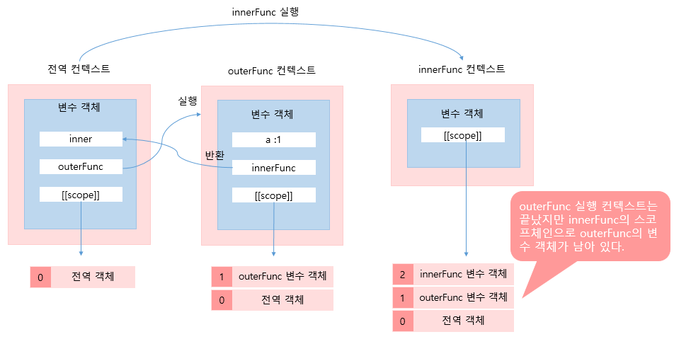

# 클로저

클로저란 자바스크립트의 스코프 체인을 이용해 생명 주기가 끝난 외부함수의 변수를 참조하는 것을 말한다.  아래의 예제는 클로저의 전형적인 패턴이다. 

```javascript
function outerFunc() {
    var a = 1; 
    
    var innerFunc = function() {
        console.log(a);
    }
    
    return innerFunc;
}

// outerFunc 함수를 호출하면 내부 함수인 innerFunc이 반환되고
// outerFunc 컨텍스트는 소멸된다. 
var inner = outerFunc();
inner(); 				
```

위 코드에서 outerFunc은 내부 함수인 innerFunc을 반환하고 소멸되었다. 여기서 반환된 내부 함수를 호출하면 outerFunc은 컨텍스트 스택에서 제거되었기때문에 내부 함수에서 지역변수 a에 접근할 수 없을거라고 생각이 든다. 하지만 결과는 1이 찍혔다.  어떻게 결과에 1이 찍혔을까? 아래의 스코프체인 그림을 보면 쉽게 알 수 있다.



outerFunc의 실행컨텍스트는 사라졌지만 outerFunc 변수 객체는 남아있고 innerFunc의 스코프 체인으로 참조되고 있기때문에 변수 a에 접근할 수 있는 것이다.

여기서 한가지 outerFunc 함수에서 innerFunc을 호출하지 않았는데 왜 innerFunc의 상위 스코프가 outerFunc이 될까라는 궁금점을 가질 수 있다.  이 이유는 **스코프는 함수를 호출할 때가 아니라 함수를 어디에 선언하였는지에 따라 결정이 되기 때문이다. ** 만약에 innerFunc이 전역에 선언되었다면 innerFunc의 상위 스코프는 전역객체가 된다. 


# 클로저의 활용

