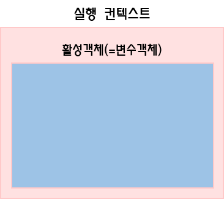
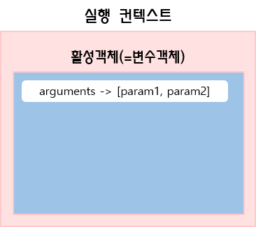
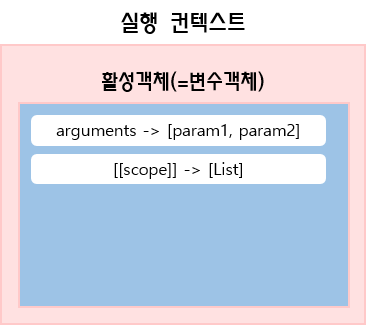
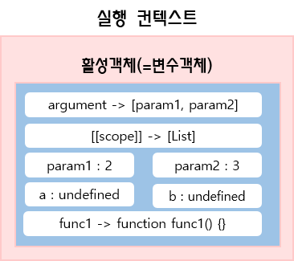
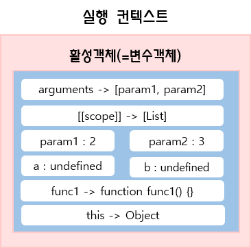

# 실행 컨텍스트

실행 컨텍스트는 추상적인 개념으로 자바스크립트 코드 블록이 실행되는 환경이다.

실행 컨텍스트가 실행되는 과정을 아래 코드를 이용해  설명을 할 것이다.

``` javascript
function func1(param1, param2) {
    var a = 10;
    var b = 20;
    
    function innerfunc() {
        return a+b;
    }
    
    return a + b + innerfunc();
}

func1(2,3);
```


1. func1() 함수가 호출되면 실행컨텍스트가 생성된다

   

   

2.  함수 내부의 정보를 담는 객체가 생성된다. 이를 활성객체 또는 변수객체라고 부른다.

   


3. argument 객체를 생성하고 활성객체의 argument 프로퍼티로 그 객체를 참조한다. 

   


4. 현재 컨텍스트의 유효범위를 나타내는 스코프 정보를 생성한다.  스코프 정보는 리스트 형태로 생성되고 이 [[scope]] 프로퍼티로 리스트를 참조할 수 있다.  현재의 컨텍스트에서 변수를 접근할 때 현재 컨텍스트에서 해당 변수를 찾지 못하면 [[scope]] 프로퍼티로 상위 실행 컨텍스트의 변수에 접근이 가능하다

   


5.  현재 컨텍스트 내부에서 사용되는 변수(func1() 함수의 내부에서 사용되는 변수)들이 생성된다.  여기서 중요한 점은 이 부분에선 변수와 함수를 메모리에 생성만 하고 초기화는 하지않는다는 점이다. 그래서 변수 a와 b에는 undefined라는 값이 할당된다.  그 후 변수객체가 생성이 완료되면 초기화가 진행된다.  이러한 **변수의 생성과 초기화의 작업이 분리되어 진행되기 때문에 함수호이스팅이 발생하는 것**이다!! 

   

   

6. 마지막으로 this 키워드를 사용하는 값이 할당된다. this 가 참조하는 객체가 없으면 전역 객체를 참조한다. 

   


