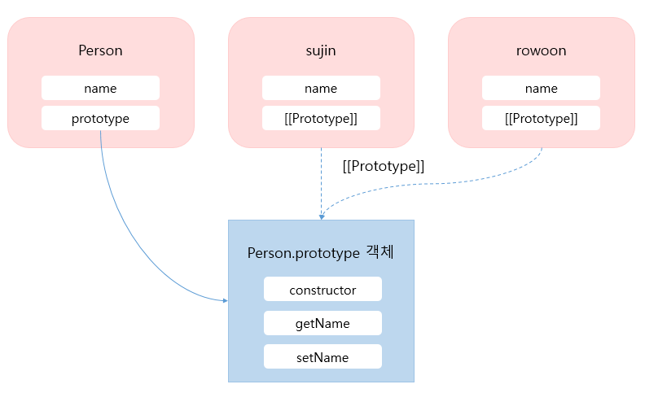
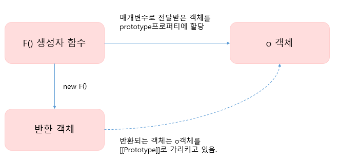
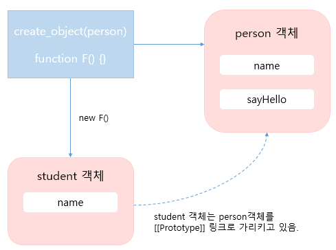

# 객체지향 프로그래밍


#### 생성자함수를 이용한 객체 생성

자바스크립트는 생성자 함수와 new 연산자를 통해 객체를 생성할 수 있다.

``` javascript
function Person(name) {
	this.name = name;
    
    this.getName = function () {
        return this.name; 
    }
    
    this.setName = function (value) { 
    	this.name = value;
    }
}

// new 키워드를 이용해 sujin 객체 생성
var sujin  = new Person("sujin");
console.log(sujin.getName());

// new 키워드를 이용해 rowoon 객체 생성
var rowoon  = new Person("rowoon");
console.log(rowoon.getName());

// new 키워드를 이용해 woonbi 객체 생성
var woonbi  = new Person("woonbi");
console.log(woonbi.getName());
```

위 코드에서 sujin, rowoon, woonbi라는 객체를 생성했다.  위 코드는 정상적으로 동작하고 있지만 한가지 큰 문제가 있다.  그것은 바로 getName() 함수와 setName() 함수를 중복해서 생성하는 것 이다.  각 객체를 찍어보면 setName() 함수와 setName() 함수가 중복되는 것을 볼 수 있다. 

```javascript
console.log(sujin);    // Person {name: "sujin", getName: ƒ, setName: ƒ}
console.log(rowoon);   // Person {name: "rowoon", getName: ƒ, setName: ƒ}
console.log(woonbi);   // Person {name: "woonbi", getName: ƒ, setName: ƒ}
```

객체를 생성할 때 중복을 제거하는 방법은 무엇일까?  바로 프로토타입을 이용하면된다!  

``` javascript
function Person(name) {
	this.name = name;
}

Person.prototype.getName = function() {
    return this.name;
}

Person.prototype.setName = function(value) {
    this.name = value;
}

// new 키워드를 이용해 sujin, rowoon 객체 생성
var sujin  = new Person("sujin");
var rowoon  = new Person("rowoon");

console.log(sujin.getName());
console.log(rowoon.getName());
```

위 코드처럼 getName()과 setName() 함수를 Person객체의 프로토타입 프로퍼티에 추가하면 Person 생성자 함수로 객체를 생성할때 getName()과 setName() 함수가 중복으로 생성되지않는다.  getName()과 setName() 함수에 접근할 땐 프로토타입 체인으로 접근할 수 있다.



위 그림처럼 메서드를 정의할때 프로토타입 객체에 정의를 한 다음 생성한 객체에서 접근 할 수 있게 하는 것이 좋다. 아래 코드는 더글라스 크락포드가 제안한 메서드 정의 방법이다.

``` javascript
// 모든 생성자 함수의 프로토타입은 Function.prototype이므로 
// 모든 생성자 함수는 Function.prototype.method에 접근할 수 있다.
Function.prototype.method = function (name, func) {
    if(!this.prototype[name]) {
        // 같은 이름의 메소드가 없으면 this(생성자함수)에 메소드를 추가한다.
        this.prototype[name] = func;
    }
}

```

더글라스 크락포드가 제안한 메서드 정의 방법을 이용해 아래와 같이 코드를 수정해보았다.

``` javascript
Function.prototype.method = function (name, func) {
    if(!this.prototype[name]) {
        this.prototype[name] = func;
    }
}

function Person(name) {
	this.name = name;
}

Person.method("setName", function (value) {
    this.name = value;
});

Person.method("getName", function () {
    return this.name;
});

var sujin = new Person("sujin");
var rowoon = new Person("rowoon");
console.log(sujin.getName());
console.log(rowoon.getName());
```


#### 프로토타입을 이용한 상속 구현

아래의 코드는 더글라스 크락포드가 자바스크립트 객체를 상속하는 방법으로 소개한 코드이다.

``` javascript
function create_object(o) {
    function F() {}
    F.prototype = o;
    return new F();
}
```



위 그림을 간단히 설명하자면 아래와 같다. 

1. 비어있는 F 생성자 함수를 생성함.
2. 매개변수로 넘어온 o 객체를 생성자 함수 F 의 prototype으로 설정함.
3. 생성자함수 F로 새로운 객체를 생성하고 반환함.


아래는 더글라스 크락포드의 객체 상속방법을 이용해 상속을 구현한 예제이다. 

``` javascript
var person = {
    name : "sujin",
    sayHello : function () {
        console.log("Hello " + this.name);
    }
};

function create_object(o) {
    function F() {}
    F.prototype = o;
    return new F();
}

var student = create_object(person);
student.name = "rowoon";

person.sayHello();
student.sayHello();
```




#### 클래스기반의 상속 구현

``` javascript


```


