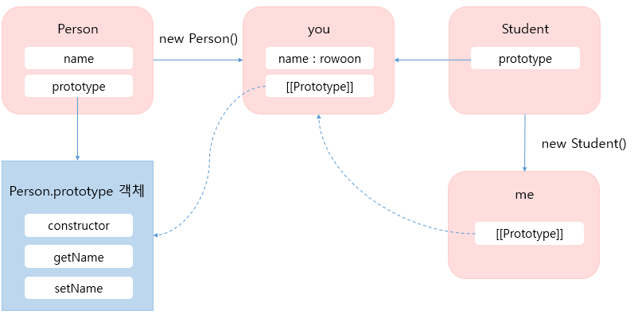

# 객체지향 프로그래밍


#### 생성자함수를 이용한 객체 생성

자바스크립트는 생성자 함수와 new 연산자를 통해 객체를 생성할 수 있다.

``` javascript
function Person(name) {
	this.name = name;
    
    this.getName = function () {
        return this.name; 
    }
    
    this.setName = function (value) { 
    	this.name = value;
    }
}

// new 키워드를 이용해 sujin 객체 생성
var sujin  = new Person("sujin");
console.log(sujin.getName());

// new 키워드를 이용해 rowoon 객체 생성
var rowoon  = new Person("rowoon");
console.log(rowoon.getName());

// new 키워드를 이용해 woonbi 객체 생성
var woonbi  = new Person("woonbi");
console.log(woonbi.getName());
```

위 코드에서 sujin, rowoon, woonbi라는 객체를 생성했다.  위 코드는 정상적으로 동작하고 있지만 한가지 큰 문제가 있다.  그것은 바로 getName() 함수와 setName() 함수를 중복해서 생성하는 것 이다.  각 객체를 찍어보면 setName() 함수와 setName() 함수가 중복되는 것을 볼 수 있다. 

```javascript
console.log(sujin);    // Person {name: "sujin", getName: ƒ, setName: ƒ}
console.log(rowoon);   // Person {name: "rowoon", getName: ƒ, setName: ƒ}
console.log(woonbi);   // Person {name: "woonbi", getName: ƒ, setName: ƒ}
```

객체를 생성할 때 중복을 제거하는 방법은 무엇일까?  바로 프로토타입을 이용하면된다!  

``` javascript
function Person(name) {
	this.name = name;
}

Person.prototype.getName = function() {
    return this.name;
}

Person.prototype.setName = function(value) {
    this.name = value;
}

// new 키워드를 이용해 sujin, rowoon 객체 생성
var sujin  = new Person("sujin");
var rowoon  = new Person("rowoon");

console.log(sujin.getName());
console.log(rowoon.getName());
```

위 코드처럼 getName()과 setName() 함수를 Person객체의 프로토타입 프로퍼티에 추가하면 Person 생성자 함수로 객체를 생성할때 getName()과 setName() 함수가 중복으로 생성되지않는다.  getName()과 setName() 함수에 접근할 땐 프로토타입 체인으로 접근할 수 있다.


위 그림처럼 메서드를 정의할때 프로토타입 객체에 정의를 한 다음 생성한 객체에서 접근 할 수 있게 하는 것이 좋다. 아래 코드는 더글라스 크락포드가 제안한 메서드 정의 방법이다.

``` javascript
// 모든 생성자 함수의 프로토타입은 Function.prototype이므로 
// 모든 생성자 함수는 Function.prototype.method에 접근할 수 있다.
Function.prototype.method = function (name, func) {
    if(!this.prototype[name]) {
        // 같은 이름의 메소드가 없으면 this(생성자함수)에 메소드를 추가한다.
        this.prototype[name] = func;
    }
}

```

더글라스 크락포드가 제안한 메서드 정의 방법을 이용해 아래와 같이 코드를 수정해보았다.

``` javascript
Function.prototype.method = function (name, func) {
    if(!this.prototype[name]) {
        this.prototype[name] = func;
    }
}

function Person(name) {
	this.name = name;
}

Person.method("setName", function (value) {
    this.name = value;
});

Person.method("getName", function () {
    return this.name;
});

var sujin = new Person("sujin");
var rowoon = new Person("rowoon");
console.log(sujin.getName());
console.log(rowoon.getName());
```


#### 프로토타입을 이용한 상속 구현

아래의 코드는 더글라스 크락포드가 자바스크립트 객체를 상속하는 방법으로 소개한 코드이다.

``` javascript
function create_object(o) {
    function F() {}
    F.prototype = o;
    return new F();
}
```


위 그림을 간단히 설명하자면 아래와 같다. 

1. 비어있는 F 생성자 함수를 생성함.
2. 매개변수로 넘어온 o 객체를 생성자 함수 F 의 prototype으로 설정함.
3. 생성자함수 F로 새로운 객체를 생성하고 반환함.


아래는 더글라스 크락포드의 객체 상속방법을 이용해 상속을 구현한 예제이다. 

``` javascript
var person = {
    name : "sujin",
    sayHello : function () {
        console.log("Hello " + this.name);
    }
};

function create_object(o) {
    function F() {}
    F.prototype = o;
    return new F();
}

var student = create_object(person);
student.name = "rowoon";

person.sayHello();
student.sayHello();
```


#### 클래스기반의 상속 구현

``` javascript
function Person(arg) {
    this.name = arg;
}

Person.prototype.setName = function (value) {
    this.name = value;
};

Person.prototype.getName = function () {
    return this.name;
};

function Student(arg) {

}

var you = new Person("rowoon");
Student.prototype = you;

var me = new Student("sujin");
me.setName("sujin");
console.log(me.getName());

```




위의 코드를 설명하면 Student 함수를 만들어 Person 생성자 함수로 생성된 you객체를 프로토타입으로 참조 `Student.prototype = you `하게 만들었다.  그런다음 Sutdent 함수로 객체를 생성하면 생성된 객체의 [[Prototype]] 링크는 you객체를 가리키게된다. 그래서 me객체는 프로토타입체이닝을 통해 Person.prototype객체의 getName과 setName을 호출할 수 있게된다.  

위의 코드는 한가지 문제점이 있는데 Person생성자 함수는 arg를 인자로 받아 name 프로퍼티를 생성하는데 `var me = new Student("sujin") ` 와 같이 me 객체를 생성할 때 인자로 넘긴 sujin을 받아 처리하는 코드는 없다. 그렇기 때문에 me는 결과적으로 빈 객체가 된다.  이를 해결하려면 아래와 같이 Student 함수에 코드를 추가해야한다.  

``` javascript
function Student(arg) {
    Person.apply(this, arguments);
}
```

위 코드는 Person함수를 호출하는데 arguments를 인자로 넘기고 Person 함수 내부에서 사용한 this를 Student로 생성된 객체(위 코드에서 this)에 바인딩을 시키는 것입니다. 


#### 캡슐화

Java나 C# 에서는 public, private 으로 변수를 선언해서 해당 정보를 외부에 노출시킬지 말지를 결정한다. 자바스크립트는 public, private 등의 키워드를 지원하지 않지만 정보 은닉이 가능하다. 

``` javascript
var Person = function(arg) {
    var name = arg ? arg : "";
    
    this.getName = function() {
        return name;
    }
    
    this.setName = function(arg){
		name = arg;
    }
};

var me = new Person(); 

console.log(me.getName());    // 

me.setName("sujin");

console.log(me.getName()); 	  // sujin
console.log(me.name);		 // undefined
```

위 코드의 ` var name` 은 private변수가 된다. 자바스크립트 함수레벨의 스코프를 제공하기 때문에 외부에서 접근이 불가능하다. 

위 코드를 조금 더 다듬으면 아래와 같이 사용할 수 있다.

``` javascript
var Person = function(arg) {
    var name = arg ? arg : "";
    
    return {
        getName : function() {
            return name;
        },
        setName : function(arg) {
			name = arg;
        }
    };
}

var me = Person();
console.log(me.getName("sujin"));
```

위 코드는 Person 함수를 호출하여 객체를 반환받고 getName, setName 메서드로 private 멤버에 접근할 수 있다.  이렇게 메서드가 담겨있는 객체를 반환하는 함수는 유명 자바스크립트 라이브러리에서 쉽게 볼 수 있는 구조이다! 이 패턴을 사용할 때는 주의해야할 점이 몇가지 있다. 

첫번째, Person 함수가 반환한 객체는 Person 함수의 프로토타입 프로퍼티 객체에 접근 할 수 없다.  이를 해결하려면 객체를 반환하는게 아니라 함수를 반환하는것이 좋다.

``` javascript
// 객체 반환
var Person = function(arg) {
    var name = arg ? arg : "";
    
    return {
        getName : function() {
            return name;
        },
        setName : function(arg) {
			name = arg;
        }
    };
}

var me = Person("sujin");

console.log(person.prototype === me.__proto__); // false
console.log(me.__proto__ === Object.prototype); // true: 

```


두번째, 접근하려는 private 멤버가 객체나 배열이면 얕은 복사로 참조만 반환하기 때문에 이후에 값 변경이 가능하다. 

``` javascript
var Array = function(){
    var arr = [1,2,3,4,5];
    
    return {
        getArray : function(){
            return arr;
        }
    };
}

var obj = Array(); 
var arr = obj.getArray();
console.log(arr);			   // (5) [1, 2, 3, 4, 5]
arr.push(6);
console.log(obj.getArray());	// (6) [1, 2, 3, 4, 5, 6]
```

위 처럼 parivate멤버의 참조값을 반환하기 때문에 외부에서도 private 멤버의 값을 변경할 수 있다. 그렇기 때문에 객체를 그대로 반환하지 않고 새로운 객체를 생성해 반환할 정보를 담아 반환해야한다! 

